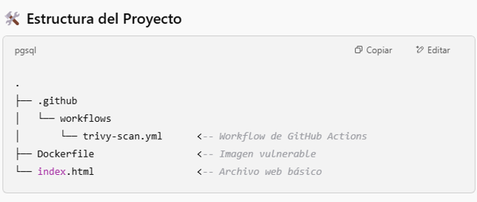

# Template GHA
Template para práctica inicial de GitHub Actions

## Estructura del proyecto

## Descripción

Este template sirve como base para iniciarnos sobre las Github Actions usando para ello el escaneo de imágenes con Trivy

